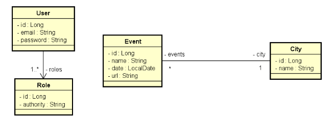

<div align="left">
  <h1><strong>Validação e Segurança</strong></h1>
</div>

## Índice

- [Sobre](#sobre)
- [Regras](#regras)
- [Como executar o projeto](#como-executar-o-projeto)
- [Tecnologias Utilizadas](#tecnologias-utilizadas)
- [Como Contribuir](#como-contribuir)

## Sobre

Este é um sistema de eventos e cidades com uma relação N-1 entre eles

<div align="center">
  
</div>

A especificação do que foi implementado está no próprio código fonte dos testes automatizados.


[Voltar ao Índice](#índice)

## Regras

### Regras de controle de acesso:
 - Somente rotas de leitura (GET) de eventos e cidades são públicas (não requer login).
 - Usuários CLIENT e/ou ADMIN podem inserir novos eventos (POST).
 - Os demais acessos são permitidos apenas a usuários ADMIN.

### Regras de validação de City:
 - Nome não pode ser vazio

### Regras de validação de Event:
 - Nome não pode ser vazio
 - Data não pode ser passada
 - Cidade não pode ser nula


[Voltar ao Índice](#índice)


## Como executar o projeto

1. Clonar o projeto a partir do GitHub

   ````https://github.com/felipeam10/Validacao-e-Seguranca````

2. Em sua IDE de preferência, abra o projeto a partir do diretório que o mesmo foi clonado. 

3. Importe as Collections do postman a partir do caminho: ````src/main/resources/postmanFiles````

[Voltar ao Índice](#índice)


## Tecnologias Utilizadas

Antes de iniciar, assegure-se de ter o ambiente Java corretamente configurado em sua máquina. Abaixo você tem a relação das tecnologias que foram utilizadas no processo de desenvolvimento do projeto.

| Tecnologia                  | Versão                                     |
| --------------------------- |--------------------------------------------|
| Sistema Operacional         | Windows 10                                 |
| Linguagem de Programação (JDK) | java 17.0.7 2023-04-18 LTS                 
| Framework                   | Spring Boot 3.1.10                         |
| Banco de Dados              | H2 Database                                |
| IDE                         | IntelliJ IDEA 2023.1.1 (Community Edition) |
| Ferramenta de Teste de API  | Postman v10.17.4                           |

[Voltar ao Índice](#índice)

## Contribuições 

Caso tenha uma contribuição que possa melhorar este projeto, por favor, abra uma issue ou um pull request, seguindo os passos abaixo.

1. Crie um 'Fork' do projeto
2. Crie uma 'Branch' para sua modificação (`git checkout -b feature/yourFeatureName`)
3. Faça o 'Commit' das suas mudanças (`git commit -m 'Add some yourFeatureName'`)
4. 'Push' para a 'Branch' (`git push origin feature/yourFeatureName`)
5. Abra uma 'Pull Request'

[Voltar ao Índice](#índice)

